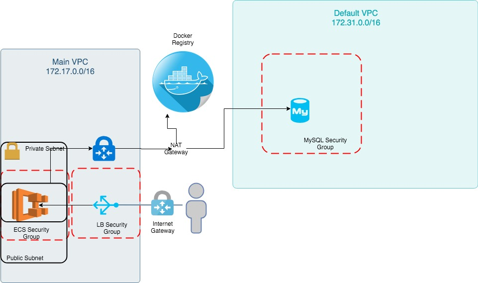

Notejam

*Performance Testing Instructions*

Insert an environmental variable called TEST_URL pointing to actual deployment and run 
* ./gradlew perfTest

*Unit and Integration Testing Instructions*

Unit and Integration test is in-built in the project, can be used via
* ./gradlew test

*Delivery Instructions*

**Java Build**
As a gradle application, ./gradlew build will create the Jar file inside build/libs folder.

**Docker**
Application must be packaged as a docker using the DOCKERFILE and pushed to appropriate registry with correct tags

Following commands accomplish that:
- docker build .
- docker tag <build#> danielyinanc/notejam-spring
- docker push danielyinanc/notejam-spring

*Deployment Instructions*

**Local Deployment**
A mySQL database must be deployed with a created database to which a bespoke user has admin access to. This information will be relayed to application
using the following environmental variables:
- JDBC_URL=jdbc:mysql://localhost:3306/notejam
- JDBC_USER=notejam
- JDBC_PASSWORD=notejam

Application can be launched for local use assuming there is a MySQL database like this:
docker run -it --env-file ./.env <build_hash/tagname>

**Cloud Deployment**

Version is controlled via the variables.tf, there is a variable called app_image which is in charge of docker 
image and the version.

Commands to follow in sequence are:
- terraform init
- terraform plan
- terraform apply 

***Scalability Controls***

- Variables.tf controls the app_count variable which is by default at 1 that controls the number of instances of notejam application.
- MYSQL variables (instance class and storage size) are adjustable via main.tf 

*Architecture*

Architecture diagram is as following:

